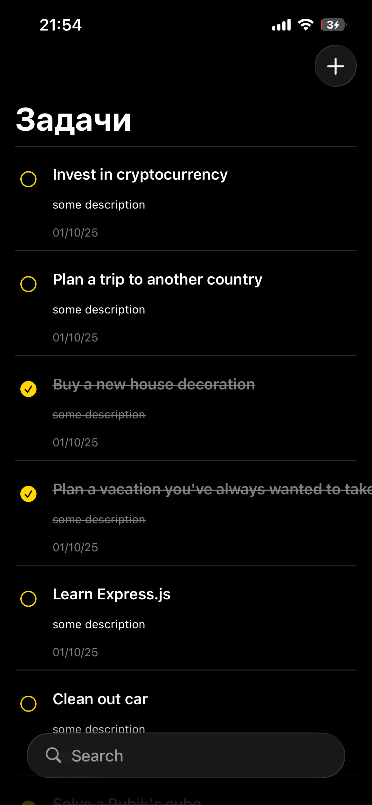
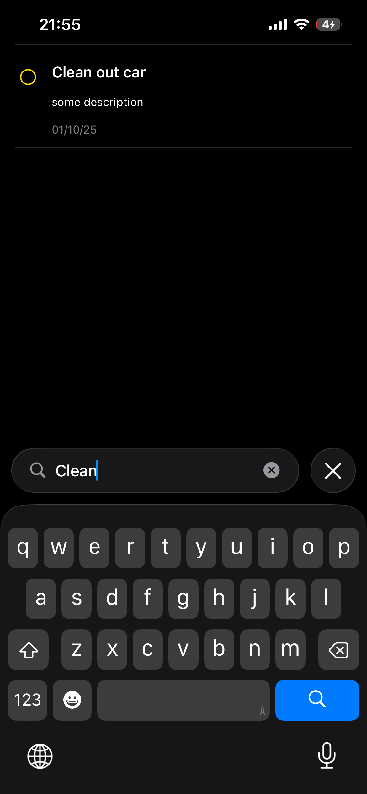
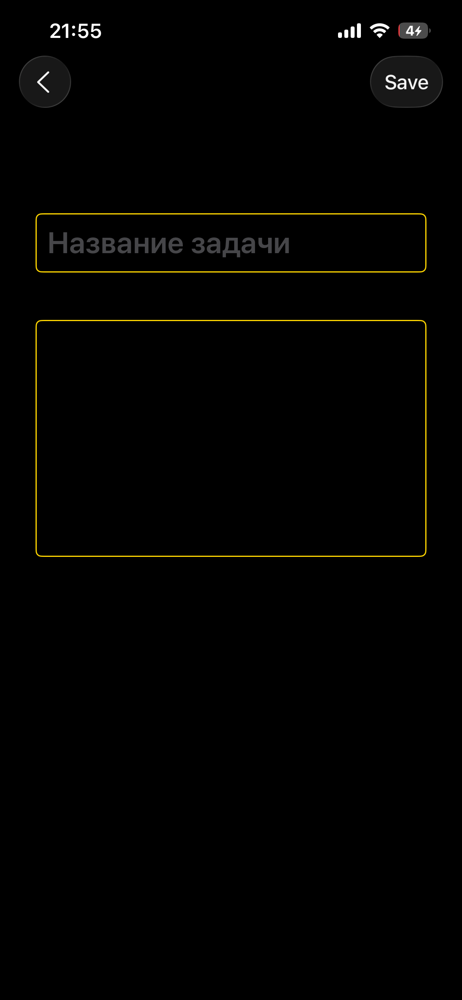
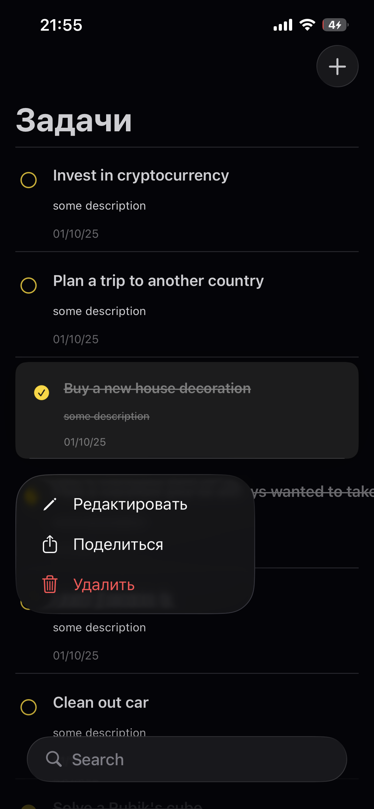

# ToDo List App 

Простое приложение для управления списком задач с использованием архитектуры VIPER.

## Функциональность 

-  **Отображение списка задач**
-  **Добавление новых задач**
-  **Редактирование существующих задач**
-  **Удаление задач**
-  **Поиск по задачам**
-  **Загрузка данных из API**
-  **Локальное сохранение в CoreData**
-  **Многопоточность с GCD**

## Скриншоты 

| Список Задач | Поиск | Создание задачи | Контексное Меню |
|-------------|--------------|---------------|---------------|
|  |  |  |  |

## Архитектура 

Приложение построено с использованием **VIPER** архитектуры:

### Компоненты VIPER:

- **View**: Отображает UI и передает пользовательские действия Presenter'у
- **Interactor**: Содержит бизнес-логику, работает с данными
- **Presenter**: Получает данные от Interactor'а и подготавливает их для View
- **Entity**: Модели данных
- **Router**: Отвечает за навигацию между модулями

